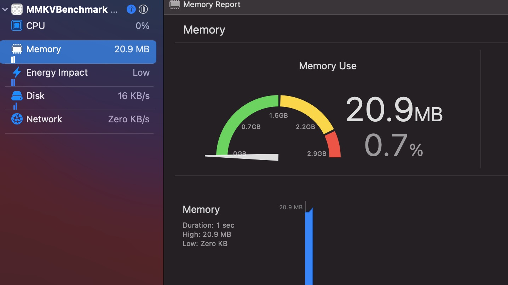
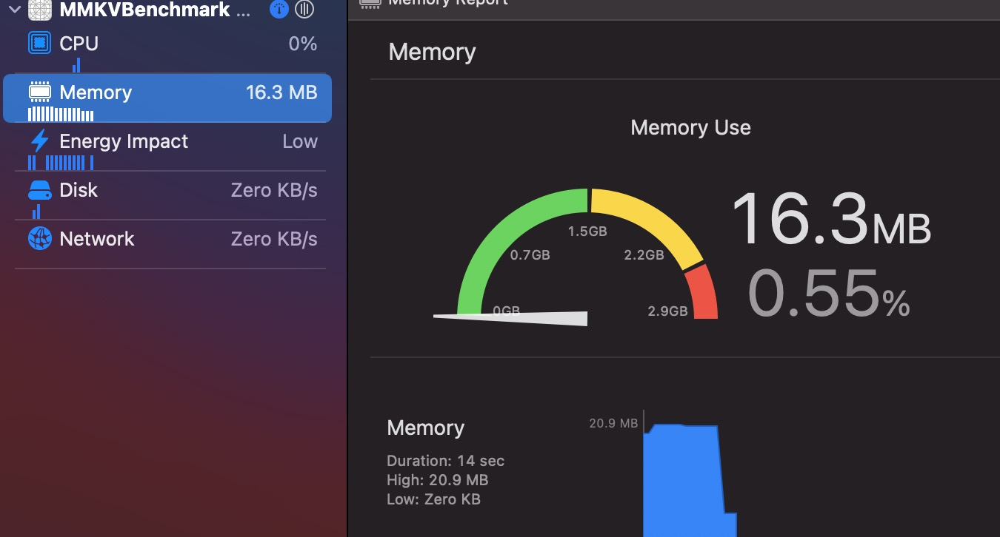
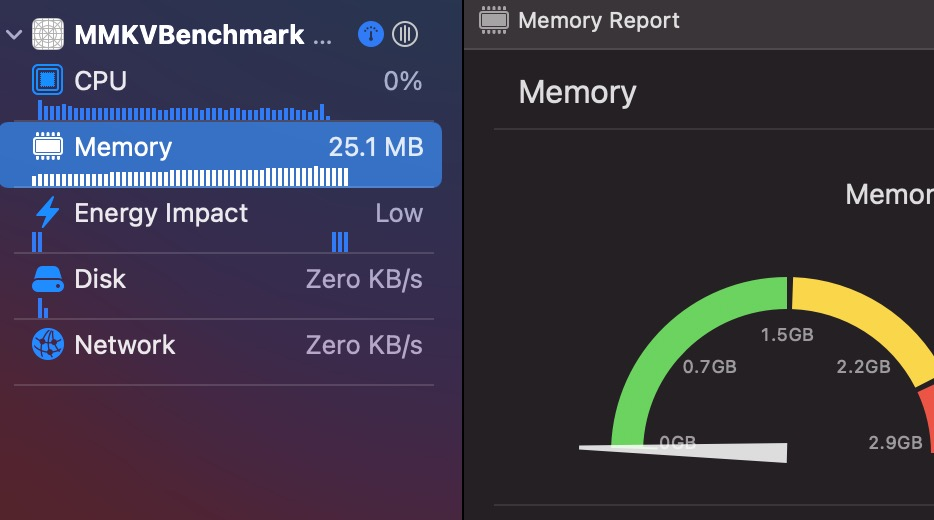

<h1> MMKVBenchmark </h1>

<h2> Read & Write Efficiency </h2>

<h3 id="iostyle"> 1000 times for Custom Data </h3>

================== MMKV_data_test write=========
take 0.034890000002633315 s
================== End ========================

================== UserDefaults_data_test write=========
take 0.02494454166298965 s
================== End ========================

================== MMKV_data_test read=========
take 0.02407445832795929 s
================== End ========================

================== Userdefault_data_test read=========
take 0.02389545833284501 s
================== End ========================

<h3 id="iostyle"> 10000 times for Custom Data </h3>

================== MMKV_data_test write=========
take 0.3244745833289926 s
================== End ========================
================== UserDefaults_data_test write=========
take 0.2508072083364823 s
================== End ========================

================== MMKV_data_test read=========
take 0.2335680833348306 s
================== End ========================
================== Userdefault_data_test read=========
take 0.23797758333239472 s
================== End ========================

<h3 id="iostyle"> 100000 times for Custom Data </h3>

================== MMKV_data_test write=========
take 3.2905941249991884 s
================== End ========================
================== UserDefaults_data_test write=========
take 2.555139500000223 s
================== End ========================

================== MMKV_data_test read=========
take 2.311659041668463 s
================== End ========================
================== Userdefault_data_test read=========
take 2.3380887499952223 s

<h3 id="iostyle"> 1000 times for Int </h3>

================== MMKV_data_test write=========
take 0.007583041668112855 s
================== End ========================
================== UserDefaults_data_test write=========
take 0.00442375000420725 s
================== End ========================

================== MMKV_data_test read=========
take 0.0014025833297637291 s
================== End ========================
================== Userdefault_data_test read=========
take 0.0021123750047991052 s
================== End ========================

<h3 id="iostyle"> 10000 times for Int </h3>

================== MMKV_data_test write=========
take 0.09541933333821362 s
================== End ========================
================== UserDefaults_data_test write=========
take 0.03827016666036798 s
================== End ========================

================== MMKV_data_test read=========
take 0.013243875000625849 s
================== End ========================
================== Userdefault_data_test read=========
take 0.017814958329836372 s
================== End ========================

<h3 id="iostyle"> 100000 times for Int </h3>

================== MMKV_data_test write=========
take 1.0223341666642227 s
================== End ========================

================== UserDefaults_data_test write=========
take 7.165420291661576 s
================== End ========================

================== MMKV_data_test read=========
take 0.1325014166723122 s
================== End ========================
================== Userdefault_data_test read=========
take 0.19595091666997178 s

100001 key-values
================== MMKV_data_test write=========
take 0.9820097083284054 s
================== End ========================
================== UserDefaults_data_test write=========
take 0.40636783333320636 s
================== End ========================

================== MMKV_data_test read=========
take 0.1343258333290578 s
================== End ========================
================== Userdefault_data_test read=========
take 0.15839074999530567 s
================== End ========================

<h2> Memory Cost </h2>

Running IO 100000 times on iPhone 8p

<h3 id="memstyle"> MMKV </h3>

Pre memory clear

Post memory clear

<h3 id="memstyle"> UserDefaults </h3>

Memory cache cannot be managed by developers.
The program blocks quite a long time with memory growing to a peak.

